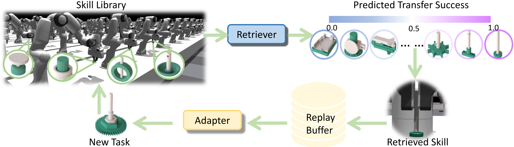

# SRSA: Skill Retrieval and Adaptation for Robotic Assembly Tasks

[](https://srsa2024.github.io/) 
[](https://arxiv.org/abs/2503.04538)

**[ICLR 2025 Spotlight]**



## Overview

SRSA is a framework to retrieve relevant skills from pre-existing skill library and finetune the relevant skills on new target tasks. This implementation is built on AutoMate environment based on Isaac Lab. We run this code with IsaacLab 2.3.0, IsaacSim 5.1, and CUDA 13.

**Key Components:**

- [Skill Retrieval](#skill-retrieval)
- [Skill Adaptation](#skill-adaptation)

## Installation

- Install Isaac Lab by following the [installation guide](https://isaac-sim.github.io/IsaacLab/main/source/setup/installation/index.html).
  We recommend using the conda installation as it simplifies calling Python scripts from the terminal.In addition, we set the environment variable:

    ```bash
    export FULL_PATH_TO_ISAACLAB=/path/to/Isaaclab/repository/
    ```

- Clone or copy this repository `SRSA` separately from the Isaac Lab installation (i.e. outside the `IsaacLab` directory). Note to clone this repository with large file storage, by installing and initiating the Git LFS extension.

- Install `rl_games` with self-imitation learning. In SRSA repository, the folder `rl_games_sil` is a fork of the public `rl_games` [repository](https://github.com/Denys88/rl_games) with our implementation of self-imitation learning. This fork is not to be taken as a replacement for the original upstream version and will not accept external contributions.

    ```bash
    cd srsa/rl_games_sil
    # use 'FULL_PATH_TO_ISAACLAB/isaaclab.sh|bat -p instead of 'python' if Isaac Lab is not installed in Python venv or conda
    python -m pip install .
    ```

- Using a python interpreter that has Isaac Lab installed, install the library in editable mode using:

    ```bash
    cd srsa
    # use 'FULL_PATH_TO_ISAACLAB/isaaclab.sh|bat -p' instead of 'python' if Isaac Lab is not installed in Python venv or conda
    python -m pip install -e source/SRSA
    ```

- Verify that the extension is correctly installed by listing the available tasks:

    ```bash
    cd srsa
    # use 'FULL_PATH_TO_ISAACLAB/isaaclab.sh|bat -p' instead of 'python' if Isaac Lab is not installed in Python venv or conda
    python scripts/list_envs.py
    ```

- Extract folders `data.tar.gz` and `checkpoints.tar.gz` in SRSA repository. The folder `data` contains asset mesh, disassembly paths and ground-truth transfer success. The folder `checkpoints` contains the pre-trained specialist policies for tasks we are interested in.
    
    ```bash
    cd srsa
    tar -xvf data.tar.gz
    tar -xvf checkpoints.tar.gz
    ```


## Skill Retrieval

- Learn embeddings for features of geometry, dynamics, and expert actions. We have the list of source and target tasks in `task_file.py`.
    
    ```bash
    cd srsa/source/SRSA/SRSA/embedding/
    # use 'FULL_PATH_TO_ISAACLAB/isaaclab.sh|bat -p instead of 'python' if Isaac Lab is not installed in Python venv or conda
    python geometry/train.py --num_epoch=24000 --asset_root_path=../../../../data/mesh --ckpt_root='geometry/ckpt'
    python dynamics/train.py --num_epoch=200 --disassembly_root_path=../../../../data/disassembly_paths --ckpt_root='dynamics/ckpt'
    python action/train.py --num_epoch=200 --disassembly_root_path=../../../../data/disassembly_paths --ckpt_root='action/ckpt'
    ```

- Train transfer success predictor for any pair of source and target tasks.
    ```bash
    python train.py --fc=128 --num_epoch=50 --asset_root_path=../../../../data/mesh --disassembly_root_path=../../../../data/disassembly_paths --transfer_success_path=../../../../data/eval_transfer --geometry_model_path=geometry/ckpt/23000.pth --dynamics_model_path=dynamics/ckpt/200.pth --action_model_path=action/ckpt/200.pth 
    ```

- Retrieve the source policy with the highest predicted transfer success.
    ```bash
    python train.py --retrieve --fc=128 --num_epoch=50 --asset_root_path=../../../../data/mesh --disassembly_root_path=../../../../data/disassembly_paths --transfer_success_path=../../../../data/eval_transfer --geometry_model_path=geometry/ckpt/23000.pth --dynamics_model_path=dynamics/ckpt/200.pth --action_model_path=action/ckpt/200.pth 
    ```
For example, as for the target task `01036`, the result of retreived task could be `00783`.


## Skill Adaptation
- Finetune the retrieved skill on the target task with sparse rewards.
    ```bash
    cd srsa
    # use 'FULL_PATH_TO_ISAACLAB/isaaclab.sh|bat -p instead of 'python' if Isaac Lab is not installed in Python venv or conda
    python source/SRSA/SRSA/tasks/direct/srsa/run_w_id.py --sparse --sil --no_sbc --assembly_id ASSEMBLY_ID --train --num_envs 128 --headless --checkpoint CHECKPOINT --load_mode actor --cfg_path ${FULL_PATH_TO_ISAACLAB}/source/isaaclab_tasks/isaaclab_tasks/direct/automate/assembly_tasks_cfg.py
    ```
  For example, we can finetune the source policy `00783.pth` on the target task `01036`. 
    ```bash
    python source/SRSA/SRSA/tasks/direct/srsa/run_w_id.py --sparse --sil --no_sbc --assembly_id 01036 --train --num_envs 128 --headless --checkpoint checkpoints/00783.pth --load_mode actor --cfg_path ${FULL_PATH_TO_ISAACLAB}/source/isaaclab_tasks/isaaclab_tasks/direct/automate/assembly_tasks_cfg.py
    ```
  We can also finetune the source policy `00211.pth` on the target task `00731`.
    ```bash
    python source/SRSA/SRSA/tasks/direct/srsa/run_w_id.py --sparse --sil --no_sbc --assembly_id 00731 --train --num_envs 128 --headless --checkpoint checkpoints/00211.pth --load_mode actor --cfg_path ${FULL_PATH_TO_ISAACLAB}/source/isaaclab_tasks/isaaclab_tasks/direct/automate/assembly_tasks_cfg.py
    ```


## Citation

```bibtex
@article{guo2025srsa,
  title={SRSA: Skill Retrieval and Adaptation for Robotic Assembly Tasks},
  author={Guo, Yijie and Tang, Bingjie and Akinola, Iretiayo and Fox, Dieter and Gupta, Abhishek and Narang, Yashraj},
  journal={arXiv preprint arXiv:2503.04538},
  year={2025}
}
```
